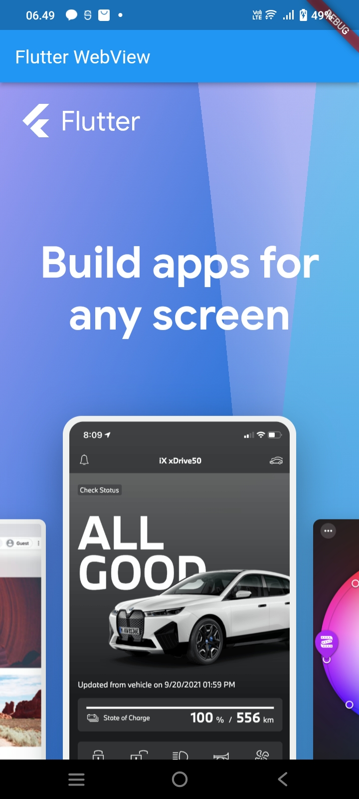
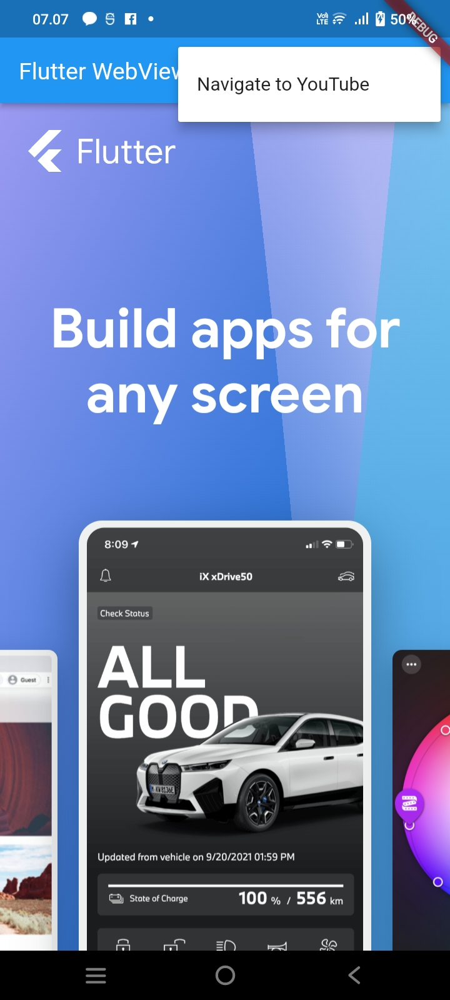
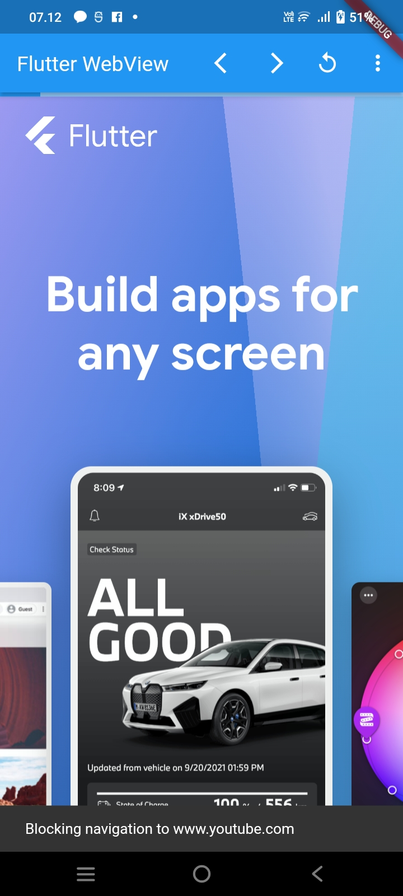
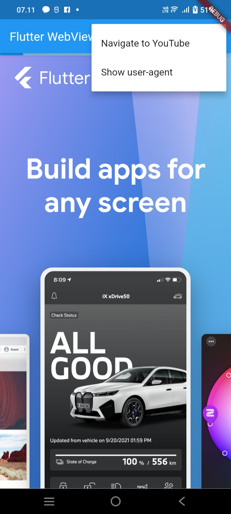
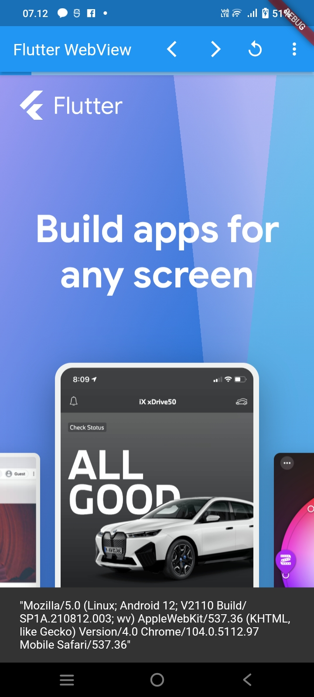
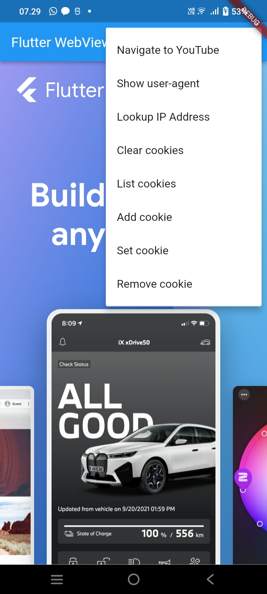
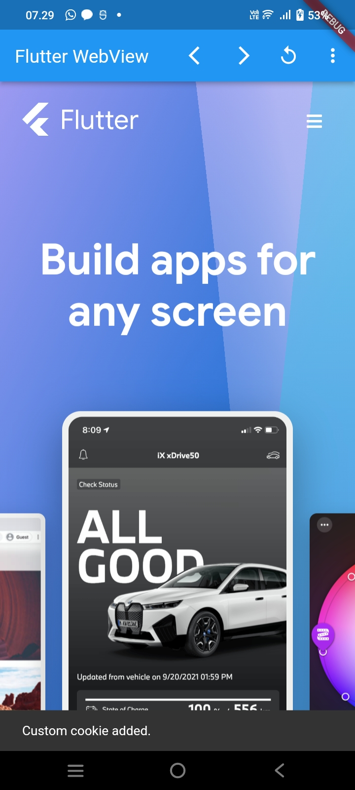
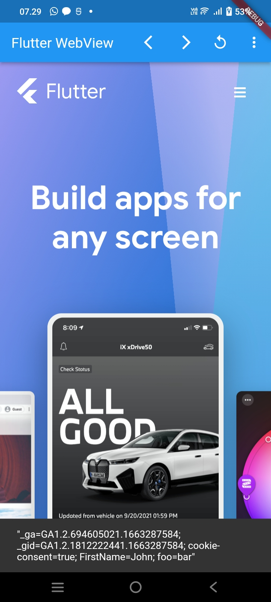
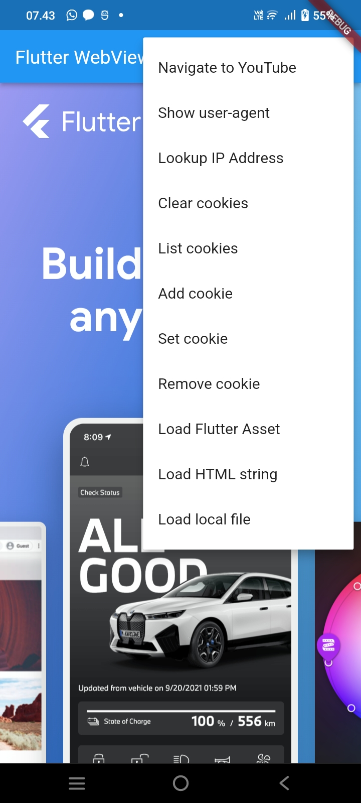

# plugin_web_view

## Addina Nurul Mawaddah

### Menambahkan widget WebView ke Aplikasi Flutter
 

### Mengakses WebViewController dari Widget WebView
 
### Menambahkan tombol menu ke AppBar
 
 

### Menambahkan JavaScript
 
 
### Mengelola Cookie

 

 
 

### Memuat aset, file, dan string HTML Flutter di WebView
 